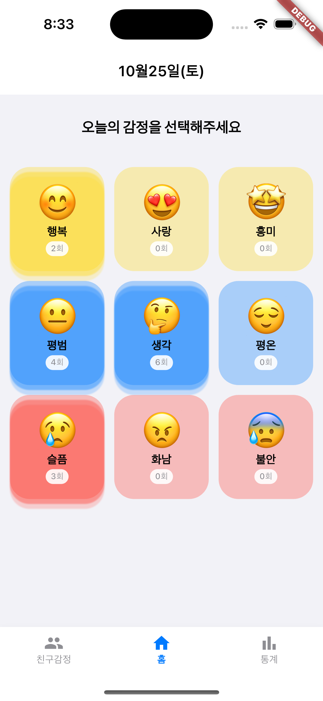

# 🎨 컬러링 무드 (Coloring Mood)

> 내 기분을 **원탭(one-tap)** 으로 기록하고,  
> 주위 친구들의 현재 **무드(Mood)** 를 가볍게 확인할 수 있는 감정 공유 애플리케이션입니다.  

---

## 🧭 요약 (Overview)

### 📌 핵심 개념
- **탭 구성:** 친구 | 홈 | 통계  
- **핵심 목적:**  
  - “**나의 상태를 추적**” + “**우리의 정서를 감지**”  
  - → 작지만 **안전한 정서적 연결**을 형성  

### 💬 왜 필요한가?
- **기분 기록은 꾸준함이 생명입니다.**  
  컬러링 무드는 **‘원탭’ 감정 입력 방식**으로 기록의 부담을 최소화했습니다.  
- **정서는 전염됩니다.**  
  팀, 직장, 친구 간의 분위기를 감지하고 이해하는 것만으로도  
  **갈등과 소진(Burnout)을 예방**할 수 있습니다.  

### 🧩 사회적 배경

요즘 사회는 너무 빠르게 돌아가고, 사람들은 각자의 마음을 숨긴 채 살아가고 있습니다.  
South Korea의 최근 자살률은 인구 10만명당 약 **28.3명**으로, 2024년 사망통계 기준 최고 수준을 기록했습니다.  
> 출처: [The Korea Herald](https://www.koreaherald.com/article/10429652?utm_source=chatgpt.com)

이처럼 자살률이 높고, 특히 ‘괜찮냐’는 질문조차 꺼내기 어려운 시대 속에서  
사람들 사이의 감정 표현과 연결은 점점 더 어려워지고 있습니다.

---

### ⚙️ 문제의식

전화 한 통, 메시지 한 줄조차 부담스럽게 느껴지는 사회적 분위기 속에서  
많은 이들은 감정을 표현하지 못한 채 스스로를 고립시키고 있습니다.  

연구에 따르면, **사회적 고립·낮은 자존감·부족한 사회적 지지**가 젊은 성인층에서 증가하고 있으며  
이는 정서적 불안과 우울감을 심화시키는 요인으로 작용하고 있습니다.  
> 출처: [Stanford Social Innovation Review](https://ssir.org/articles/entry/solutions-social-isolation-south-korea?utm_source=chatgpt.com)

또한, 한국 사회에서는 감정 표현이나 심리적 어려움을 드러내는 것에 대한  
문화적 장벽이 여전히 존재하고 있으며, 이로 인해 내부 감정을 외부로 꺼내지 못하는 경우가 많습니다.  
> 출처: [Frontiers in Psychiatry](https://www.frontiersin.org/journals/psychiatry/articles/10.3389/fpsyt.2024.1423609/full?utm_source=chatgpt.com)

따라서 **친구나 가족에게 직접 감정을 묻고 공유하지 않아도, 자연스럽게 감정을 알아차릴 수 있는 새로운 방식**이 필요합니다.

---

### 🌈 해결 방향

이러한 문제를 해결하기 위해 “**컬러링 무드 (Coloring Mood)**”를 개발하였습니다.  
이 애플리케이션은 터치 한 번으로 감정을 **컬러와 무드**로 표현하며,  
친구들의 감정 상태를 시각적으로 확인할 수 있도록 설계되었습니다.  

또한 **Analytics 기능**을 통해 한 달간의 감정 변화를  
데이터 기반으로 시각화하여 자신의 감정 패턴을 되돌아볼 수 있습니다.  
이를 통해 감정 관리뿐 아니라, **사회적 연결성 회복**을 목표로 합니다.

---

### 💖 기대효과

말하지 않아도 서로의 마음을 이해할 수 있는 사회,  
감정이 **색으로, 터치로 전달되는 세상**을 꿈꿉니다.  

“**컬러링 무드**”는 감정 공유를 통한 **공감의 시작점**이 될 것입니다.  
사용자는 자신과 친구의 감정을 쉽게 인식하고,  
이를 바탕으로 감정적 대화와 관계 회복의 물꼬를 틀 수 있습니다.

---

## 🧠 Keywords
`감정공유` · `감정기록` · `정서관리` · `소셜힐링` · `마음건강` · `Color UI` · `Mood Analytics`

---

## 👩‍💻 Contributors
해커톤 팀 **컬러링 무드 (Coloring Mood)**

